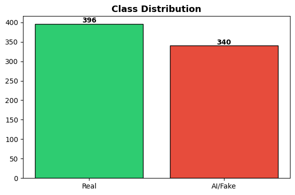
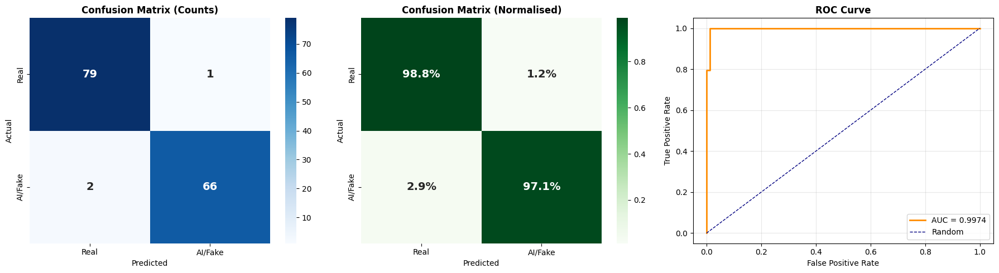
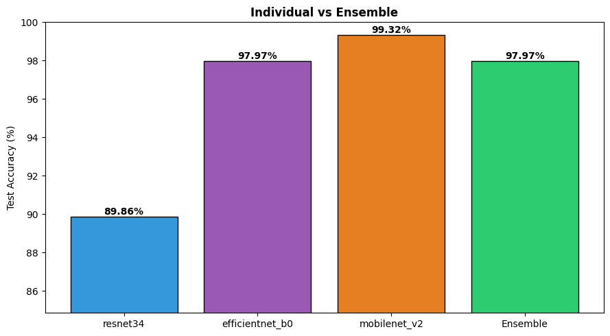

# AI Receipt Classifier Ensemble
### CNN Ensemble (ResNet34 + EfficientNet-B0 + MobileNet-V2) + XGBoost

This project implements a hybrid machine learning pipeline to detect whether a digital receipt screenshot is **Real** (human-generated) or **AI-generated**. By leveraging a "best of both worlds" approach, we extract deep spatial features using pretrained CNNs and classify them using regularized XGBoost models.

The pipeline combines predictions via **Soft-Voting Ensemble**, achieving a robust **97.97% test accuracy**.

## Dataset Distribution
The model was trained on a balanced dataset of cleaned receipt images, ensuring the classifier doesn't develop a bias toward one specific class.

## Results & Evaluation
The ensemble model demonstrates exceptional generalization. While individual models performed well, the ensemble provides a more stable decision boundary, as evidenced by the high ROC-AUC.

### Key Metrics
* **Accuracy**: 97.97%
* **Precision (Weighted)**: 97.98%
* **Recall (Weighted)**: 97.97%
* **F1-Score (Weighted)**: 97.97%
* **ROC-AUC**: 0.9974
* **Ensemble CV Mean**: 97.79% (± 0.87% Std Dev)

### Performance Visualizations
The confusion matrix shows only 3 misclassifications out of 148 test samples, while the ROC curve indicates nearly perfect separability between real and fake receipts.

### Individual vs. Ensemble Comparison
While MobileNetV2 achieved the highest individual test accuracy in this specific run, the Ensemble is utilized to ensure the most reliable generalization across diverse, unseen datasets.

## Key Anti-Overfitting Strategies
To ensure high performance translates to real-world data, the following constraints were applied to the XGBoost meta-classifiers:
* **Tree Depth**: Limited to 4 to prevent over-complex branching.
* **Learning Rate**: Reduced to 0.05 for more stable convergence.
* **Stochastic Sampling**: 80% row and column sampling per tree.
* **Regularization**: Applied both $L_1$ (Alpha) and $L_2$ (Lambda) penalties.
* **Early Stopping**: Training halts if validation loss stops improving for 30 rounds.

## Implementation Notes
This model is optimized for structured receipt formats. For maximum accuracy during inference:
1.  **Resize**: Images must be resized to **224x224** pixels.
2.  **Color**: Convert images to **RGB** (standardize 3 channels).
3.  **Normalize**: Use ImageNet statistics: 
    * Mean: `[0.485, 0.456, 0.406]`
    * Std Dev: `[0.229, 0.224, 0.225]`
